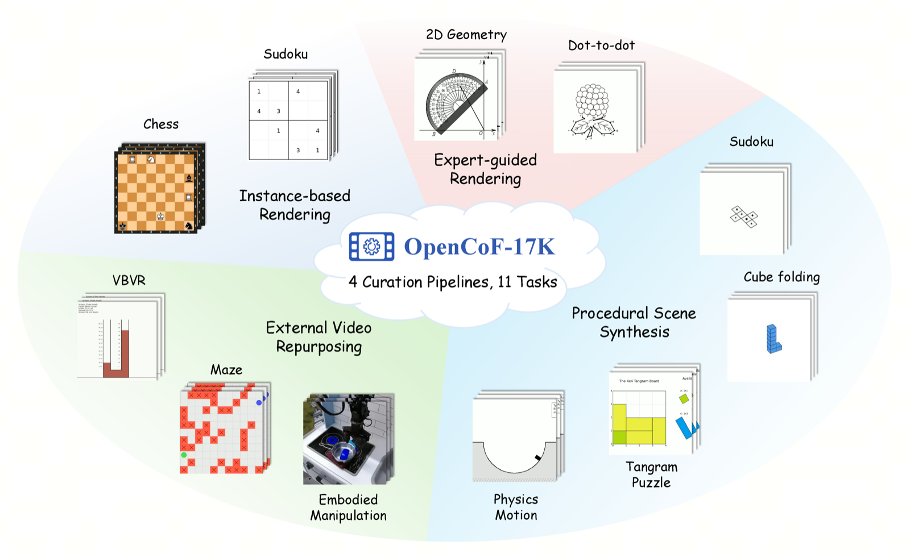
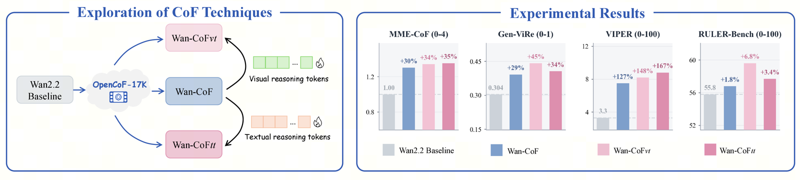

# OpenCoF: Learning to Reason Through Video Generation

Official repository for the paper **"[OpenCoF: Learning to Reason Through Video Generation](https://arxiv.org/abs/2607.08763)"**.

[[🌐 Project Page](https://opencof.github.io/)] [[📖 Paper](https://arxiv.org/abs/2607.08763)]

## 💥 News

- **[2026.09]** The [OpenCoF-17K dataset](https://huggingface.co/datasets/xy06/OpenCoF-17k) is now publicly available on Hugging Face.
- **[2026.07]** Code, dataset, and model release is pending internal company review.

## 👀 About OpenCoF

Reasoning has become a core capability for large models, especially when reliable decisions require understanding logical consequences. Recent video generation models offer a reasoning path distinct from previous Chain-of-Thought (CoT): reasoning can unfold through temporally connected frames, known as **Chain-of-Frame (CoF) reasoning**. However, existing video generators are primarily trained on general video corpora, still lacking diverse supervision and dedicated designs for CoF reasoning.

To address this gap, we introduce **OpenCoF**, a framework built around **OpenCoF-17K**, a reasoning video dataset of 17,312 videos spanning 11 task families, curated through four complementary pipelines: instance-based rendering, expert-guided rendering, procedural scene synthesis, and external video repurposing.

<p align="center">
     <br>
</p>

We use OpenCoF-17K to fine-tune Wan2.2-I2V-A14B into **Wan-CoF**, which achieves considerable gains over the baseline across four external video-reasoning benchmarks (MME-CoF, Gen-ViRe, VIPER, RULER-Bench) purely from data supervision. Building on this, we further explore two complementary reasoning-token designs, Visual Reasoning Tokens (*vt*) and Textual Reasoning Tokens (*tt*), which respectively capture low-level visual cues and high-level semantic priors, yielding Wan-CoF<sub>vt</sub> and Wan-CoF<sub>tt</sub> with further gains.

<p align="center">
     <br>
</p>

Our results suggest that stronger video reasoning requires both broad temporal supervision and explicit mechanisms for organizing intermediate reasoning state.

## 🚧 Code, Model & Dataset

The code and model checkpoints are currently going through internal company review before public release.

- [ ] Code &mdash; Coming soon
- [x] [OpenCoF-17K dataset](https://huggingface.co/datasets/xy06/OpenCoF-17k)
- [ ] Wan-CoF model checkpoints &mdash; Coming soon

## 📖 Citation

If you find OpenCoF useful for your research, please consider citing our paper:

```bibtex
@article{chen2026opencof,
  title   = {OpenCoF: Learning to Reason Through Video Generation},
  author  = {Chen, Xinyan and Guo, Ziyu and Zhang, Renrui and Jiang, Dongzhi and Li, Hongsheng},
  journal = {arXiv preprint arXiv:2607.08763},
  year    = {2026}
}
```
