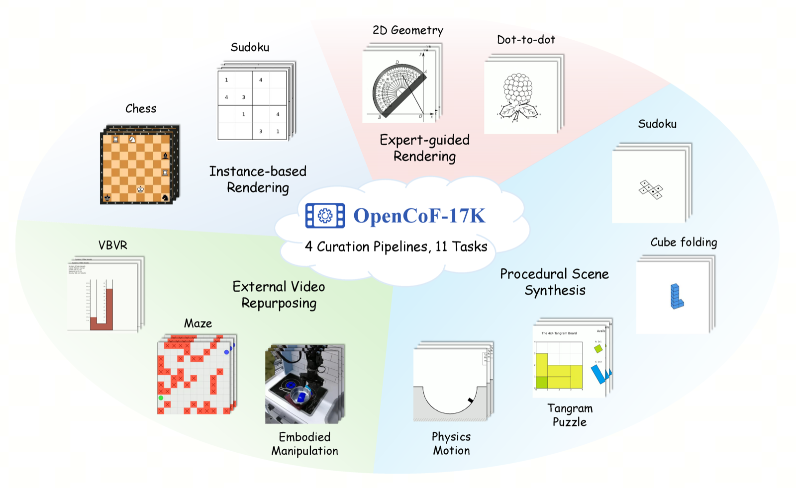
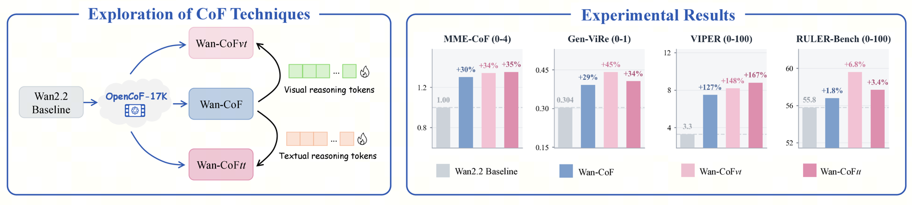

# **🔥 [NeurIPS 2026] OpenCoF:** Learning to Reason Through Video Generation

Official repository for the paper **"[OpenCoF: Learning to Reason Through Video Generation](https://arxiv.org/abs/2607.08763)"**.

[[🌐 Project Page](https://opencof.github.io/)] [[📖 Paper](https://arxiv.org/abs/2607.08763)] [[🤗 Dataset](https://huggingface.co/datasets/xy06/OpenCoF-17k)] [[🤗 Model](https://huggingface.co/xy06/Wan-CoF)]

## 💥 News

- **[2026.10]** The training, inference, and evaluation code is now publicly available.
- **[2026.10]** The [Wan-CoF model](https://huggingface.co/xy06/Wan-CoF) is now publicly available on Hugging Face.
- **[2026.09]** OpenCoF has been accepted by NeurIPS 2026! 🎉🎉
- **[2026.09]** The [OpenCoF-17K dataset](https://huggingface.co/datasets/xy06/OpenCoF-17k) is now publicly available on Hugging Face.

## 👀 About OpenCoF

Reasoning has become a core capability for large models, especially when reliable decisions require understanding logical consequences. Recent video generation models offer a reasoning path distinct from previous Chain-of-Thought (CoT): reasoning can unfold through temporally connected frames, known as **Chain-of-Frame (CoF) reasoning**. However, existing video generators are primarily trained on general video corpora, still lacking diverse supervision and dedicated designs for CoF reasoning.

To address this gap, we introduce **OpenCoF**, a framework built around **OpenCoF-17K**, a reasoning video dataset of 17,312 videos spanning 11 task families, curated through four complementary pipelines: instance-based rendering, expert-guided rendering, procedural scene synthesis, and external video repurposing.

<p align="center">
     <br>
</p>

We use OpenCoF-17K to fine-tune Wan2.2-I2V-A14B into **Wan-CoF**, which achieves considerable gains over the baseline across multiple external video-reasoning benchmarks purely from data supervision. Building on this, we further explore two complementary reasoning-token designs, Visual Reasoning Tokens (*VT*) and Textual Reasoning Tokens (*TT*), which respectively capture low-level visual cues and high-level semantic priors and bring further gains.

<p align="center">
     <br>
</p>

Our results suggest that stronger video reasoning requires both broad temporal supervision and explicit mechanisms for organizing intermediate reasoning state.

## 🚧 Code, Model & Dataset

- [x] Code &mdash; this repository
- [x] [OpenCoF-17K dataset](https://huggingface.co/datasets/xy06/OpenCoF-17k)
- [x] [Wan-CoF model checkpoints](https://huggingface.co/xy06/Wan-CoF)

## 🔧 Installation

Python >= 3.10 and PyTorch >= 2.0 with CUDA are required. Install a PyTorch
build that matches your CUDA driver first (see
[pytorch.org](https://pytorch.org/get-started/locally/)); otherwise
`pip install -e .` pulls the latest PyTorch wheel, which may need a newer
driver than you have. For example, for CUDA 12.x:

```bash
pip install torch==2.7.1 torchvision==0.22.1 --index-url https://download.pytorch.org/whl/cu126
```

Then install the repository:

```bash
git clone https://github.com/xinyan-cxy/OpenCoF.git
cd OpenCoF
pip install -e .

# Evaluation only
pip install opencv-python openai colorama openpyxl
# Only if you log to Weights & Biases
pip install wandb
```

## 📦 Download

**Base model.** Wan-CoF is a LoRA adapter on top of
[Wan2.2-I2V-A14B](https://huggingface.co/Wan-AI/Wan2.2-I2V-A14B), which is
required for both inference and training:

```bash
hf download Wan-AI/Wan2.2-I2V-A14B --local-dir /path/to/Wan2.2-I2V-A14B
```

**Wan-CoF.** [xy06/Wan-CoF](https://huggingface.co/xy06/Wan-CoF) contains a
high-noise and a low-noise LoRA, one for each of the two Wan2.2 denoising
experts; they form one model and are always used together. The inference script
below downloads them automatically. To get a local copy (e.g. for evaluation):

```bash
hf download xy06/Wan-CoF --local-dir /path/to/Wan-CoF
```

**Dataset.** [OpenCoF-17K](https://huggingface.co/datasets/xy06/OpenCoF-17k) is
stored as Parquet shards with the videos embedded, so it can be browsed or
streamed directly with `load_dataset("xy06/OpenCoF-17k")`. Training reads
plain `.mp4` files plus a `metadata.csv`; export them with:

```bash
python scripts/prepare_data.py --output_dir /path/to/OpenCoF-17k
```

## 🎬 Inference

```bash
python scripts/inference_wan_cof.py \
    --model_dir /path/to/Wan2.2-I2V-A14B \
    --image cube_net.png \
    --prompt "Fold the net upward into a cube, keeping the camera fixed." \
    --output output.mp4
```

The input image is padded to 832&times;480 and an 81-frame video is generated
(`--seed 1`, `--cfg_scale 5` by default, the settings used in the paper). To
run a checkpoint you trained yourself, pass `--high_noise_lora` and
`--low_noise_lora`; the number of reasoning tokens is read from the checkpoint,
so the same script works for all three training recipes below.

## 🚀 Training

Every recipe fine-tunes LoRA adapters (rank 32) for both experts of
Wan2.2-I2V-A14B on OpenCoF-17K, training the high-noise expert first and then
the low-noise expert.

| Recipe | Script |
| --- | --- |
| Wan-CoF (data only) | `scripts/train/wan_cof.sh` |
| Visual Reasoning Tokens (VT) | `scripts/train/wan_cof_visual_reasoning_tokens.sh` |
| Textual Reasoning Tokens (TT) | `scripts/train/wan_cof_textual_reasoning_tokens.sh` |

```bash
export MODEL_DIR=/path/to/Wan2.2-I2V-A14B
export DATA_DIR=/path/to/OpenCoF-17k      # output of scripts/prepare_data.py
export OUTPUT_DIR=./outputs
bash scripts/train/wan_cof.sh
```

## 📊 Evaluation

Wan-CoF is evaluated on [MME-CoF](https://video-cof.github.io/),
[VIPER](https://arxiv.org/abs/2512.24952), and
[RULER-Bench](https://arxiv.org/abs/2512.02622); the harnesses live under
`eval/{mme-cof,VIPER,ruler_bench}/`.

Each benchmark has an inference stage (video generation) and an LLM-as-judge
evaluation stage. The judge is called through an **OpenAI-compatible endpoint**
that you configure yourself.

**Benchmark data.** Download the benchmarks from their official releases. VIPER
and RULER-Bench also need their code repositories, which hold the judge
prompts:

```bash
# MME-CoF: data.json + images
hf download ZiyuG/MME-CoF --repo-type dataset --local-dir /path/to/MME-CoF

# VIPER: dataset.parquet (unpacked automatically on first run) + judge prompts
hf download Monosail/VIPER --repo-type dataset --local-dir /path/to/VIPER-dataset
git clone https://github.com/RUCAIBox/VIPER.git /path/to/VIPER

# RULER-Bench: data.jsonl + images, and the judge system prompt from the code repo
hf download hexmSeeU/RULER-Bench --repo-type dataset --local-dir /path/to/RULER-Bench-data
git clone https://github.com/hexmSeeU/RULER-Bench.git /path/to/RULER-Bench
```

**Run.**

```bash
export OPENAI_API_BASE="https://your-openai-compatible-endpoint/v1"
export OPENAI_API_KEY="your-api-key"

bash eval/run.sh --stage all \
    --model /path/to/Wan2.2-I2V-A14B \
    --high_noise_lora /path/to/Wan-CoF/high_noise_lora/model.safetensors \
    --name wan_cof \
    --output_root /path/to/eval_output \
    --mme_data /path/to/MME-CoF/data.json \
    --mme_data_root /path/to/MME-CoF \
    --viper_data_root /path/to/VIPER-dataset \
    --viper_repo /path/to/VIPER \
    --ruler_data /path/to/RULER-Bench-data/data.jsonl \
    --ruler_data_root /path/to/RULER-Bench-data \
    --ruler_system_prompt /path/to/RULER-Bench/eval/system_prompt.txt
```

This runs inference and judging for all three benchmarks; use `--stage` to run
a single step (e.g. `infer_viper`, `eval_mme`; see the header of `eval/run.sh`).
The data paths can also be set once at the top of `eval/run.sh` instead of
being passed as flags, and the judge model is chosen with `--eval_model`
(default `gemini-2.5-pro`).

The benchmark harnesses under `eval/` are adapted from the original benchmark
repositories; each retains its upstream copyright and license (see the file
headers and `NOTICE`).

## 🙏 Acknowledgements

This project is built on top of
[DiffSynth-Studio](https://github.com/modelscope/DiffSynth-Studio) (Apache-2.0)
and the public [Wan2.2-I2V-A14B](https://huggingface.co/Wan-AI/Wan2.2-I2V-A14B)
model, and its evaluation reuses the MME-CoF, VIPER, and RULER-Bench benchmarks.
We thank the authors and the open-source community. See `NOTICE` for attribution.

## 📄 License

The code in this repository is released under the Apache License 2.0. See
[LICENSE](./LICENSE) and [NOTICE](./NOTICE).

The OpenCoF-17K dataset is licensed separately under
[CC BY 4.0](https://creativecommons.org/licenses/by/4.0/), and parts of it are
adapted from upstream datasets whose own licenses continue to apply; see the
[dataset card](https://huggingface.co/datasets/xy06/OpenCoF-17k) for details.
The released LoRA adapters are under Apache-2.0 and require the separately
licensed Wan2.2-I2V-A14B base model; see the
[model card](https://huggingface.co/xy06/Wan-CoF).

## 📖 Citation

If you find OpenCoF useful for your research, please consider citing our paper:

```bibtex
@article{chen2026opencof,
  title   = {OpenCoF: Learning to Reason Through Video Generation},
  author  = {Chen, Xinyan and Guo, Ziyu and Zhang, Renrui and Jiang, Dongzhi and Li, Hongsheng},
  journal = {arXiv preprint arXiv:2607.08763},
  year    = {2026}
}
```
